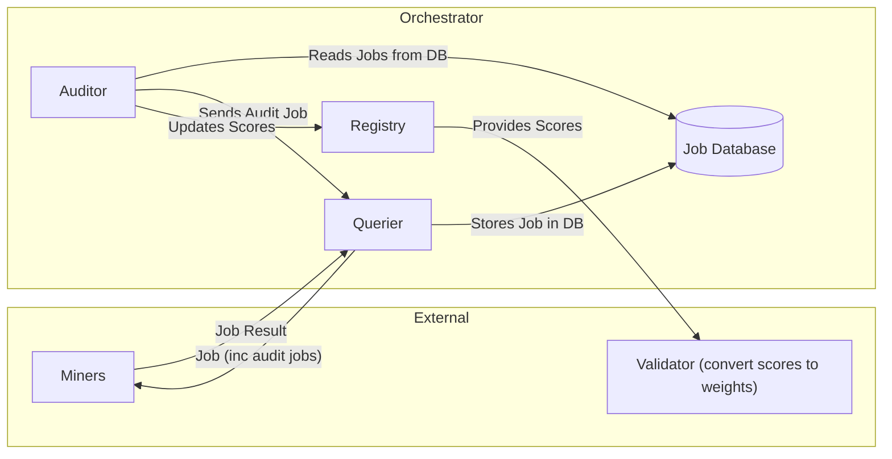

# Dippy Studio Architecture

## 1. Introduction

### 1.1 Background

Dippy Studio's ultimate goal is to provide a decentralized platform that offers the best application level image generation tools, askin to fal.ai 

### 1.2 Current Objectives

- Fast LoRA training
- Fast LoRA inference

### 1.3 Scope

We focus on the following cases initially:
- LoRA training from single images
- Inference on provided LoRA models

## 2. Service Overview

There are essentially three service entities:
1. Validators
2. Miners
3. Orchestrator

Essentially, miners fulfill tasks for orchestrators, whether that be inference, LoRA training, or anything else. 
Partially completed tasks will not count, a task is either valid or not according to the validation mechanism.
Orchestrators manage the incoming tasks and convert to scores which can then be converted to weights by validators.

## 3. Incentive Mechanism

### 3.1 Reward Distribution Model

#### Miner Rewards

Miners will receive a score based on the following:

1. **Completed requests**: Requests/tasks will be considered "completed" as long as the response is 200 and the request is marked as valid

2. **Request latency**: 
   - Request latency will be measured in raw ms taken from request to response (network delays will be factored in)
   - The raw ms taken will be evaluated on a linear scale (exact formula for this will be heavily adjusted)
   - Any latency more than 90% of the maximum timeout will receive 0 score

Since training can be costlier than inference, we will assign weighted scores for each successfully completed and validated task.

Currently, we will weight training requests at 0.7 and inference requests at 0.3.

Example:
1. Completed 10 LoRA training requests: receive score of 0.7 per request → total sum of 7
2. Completed 10 inference requests: receive score of 0.3 per request → total sum of 3

A miner in this case could have a maximum possible score of 10. If the miner chooses to fulfill only inference requests, they will receive only a score of 3. Miners that only provide one service type will only be queried for that service type but receive lower overall score.

### 3.2 Win Rate Calculation

Given the final score for a miner, these scores will then be converted to win rates via comparing scores of each miner against each other. Ties are unlikely given the number of requests being sent, but will simply result in having the same win rate. There is no minimum score threshold to be eligible for rewards.

Once converted to winrates, we will apply the emission schedule via applying temperature (Python implementation to be provided at a later time).

Weights will be set every 360 blocks (rough equivalent of 20 minutes). Since the final weights are derived from scores, we will treat the on chain validation as a mechanism separate from the process of creating and calculating the scores themselves. These weights can be adjusted dynamically over time.

